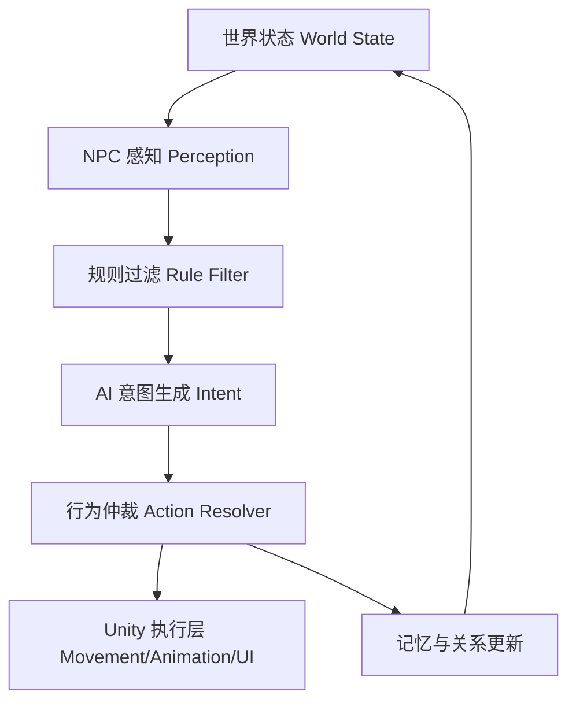
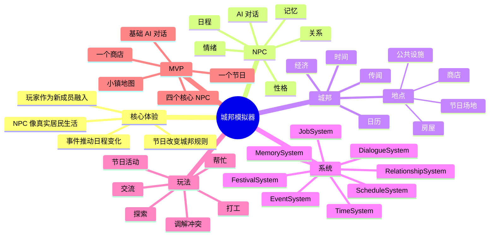

# 城邦模拟器设计总纲

> 目标：把当前构想整理成一份便于后续实现、拆任务和扩展的设计文档。本文优先服务开发思考，不追求一次性定死所有内容。

## 1. 核心定位

### 1.1 游戏一句话

一个 2D 八方向像素风城邦生活模拟游戏。玩家作为新成员进入城邦，与拥有 AI、日程、记忆、个性和社会关系的 NPC 共同生活、交流、工作，并在节日和突发事件中影响城邦的发展。

### 1.2 设计支柱

1. **城邦像活物一样运转**
   - NPC 有日程、住处、职业、关系网、需求和偏好。
   - 地点不是纯背景，而是社会行为和事件发生的容器。
   - 公共设施、商店、NPC 房屋、节日场地共同构成城邦日常循环。

2. **NPC 不是固定台词机**
   - NPC 拥有基础性格、当前情绪、长期记忆、关系态度和生活目标。
   - 面对不同玩家、NPC、事件、节日，会有个性化反应。
   - AI 输出不直接决定一切，需要被游戏规则、状态机和安全边界约束。

3. **玩家是新成员，而不是救世主**
   - 初期目标是融入城邦：认识人、获得信任、找到日常位置。
   - 玩家可以打工、交谈、参加节日、帮助处理事件、改变关系网。
   - 玩家行为应逐渐影响 NPC 对玩家的看法和城邦氛围。

4. **节日改变规则**
   - 节日不是换皮活动，而是短期改变城邦行为规则。
   - 例如“相反日”：NPC 行为、说话风格、工作态度、社交倾向与平时反向。
   - 节日可以制造稀有互动、特殊任务、冲突和玩家记忆点。

5. **可模拟，但不失控**
   - 游戏需要表现出复杂性，但内部实现应可调试、可回放、可限制成本。
   - AI 负责“表达和选择倾向”，核心状态变化仍由可控系统管理。

## 2. 玩家体验循环

### 2.1 单日循环

1. 醒来，查看日历、消息、天气、今日节日或城邦公告。
2. 规划行动：拜访 NPC、打工、探索地点、参与公共事件。
3. 与 NPC 交流，获得情报、委托、关系变化或情绪反馈。
4. 城邦系统推进：NPC 按日程行动，事件触发，关系和记忆更新。
5. 晚上回顾：记录今日重要互动、收入、关系变化、未完成事项。

### 2.2 中期循环

1. 认识更多 NPC，理解城邦派系、职业和社交结构。
2. 获得商店打工资格、特定地点权限、节日参与身份。
3. 通过选择影响 NPC 对玩家的信任、亲近、警惕或依赖。
4. 开始介入外部事件，例如纠纷、短缺、庆典筹备、设施损坏。

### 2.3 长期循环

1. 玩家成为城邦的重要成员。
2. NPC 关系网随玩家行为和事件发生长期变化。
3. 节日、政治决策、公共设施建设、职业生态产生连续影响。
4. 城邦形成属于本轮游玩的历史。

## 3. 世界结构

### 3.1 地点类型

| 类型 | 功能 | 示例 |
| --- | --- | --- |
| NPC 房屋 | 睡眠、私人互动、家庭事件 | 木匠家、学者家、店主家 |
| 商店 | 交易、打工、职业社交 | 杂货铺、药铺、工坊、餐馆 |
| 公共设施 | 高频社交和城邦功能 | 广场、公告栏、会堂、诊所、图书馆 |
| 生产地点 | 工作日程和资源来源 | 农田、矿洞、码头、仓库 |
| 节日地点 | 特殊规则和大型聚集 | 广场、礼堂、临时集市 |
| 边缘地点 | 探索、风险和突发事件 | 城门、废墟、森林边缘 |

### 3.2 地点应具备的数据

- 唯一 ID
- 显示名称
- 类型
- 所属区域
- 开放时间
- 可进入条件
- 容量或拥挤度
- 默认互动点
- 可触发事件列表
- 节日期间覆盖规则
- NPC 常用座标点或行动点

## 4. NPC 设计

### 4.1 NPC 分层

1. **核心 NPC**
   - 有完整个性、职业、日程、长期剧情、AI 记忆和关系网。
   - 玩家可深度交流，可影响其生活路线。

2. **功能 NPC**
   - 主要承担商店、设施、任务发放、节日组织等功能。
   - 有简化关系和日程，但仍能响应事件。

3. **背景居民**
   - 用于营造城邦密度。
   - 可使用模板日程和轻量对话，不接入完整 AI 成本。

### 4.2 NPC 核心数据

| 分类 | 字段 |
| --- | --- |
| 身份 | id、姓名、年龄段、职业、住处、常驻地点 |
| 性格 | 外向/内向、守序/随性、善良/功利、勇敢/谨慎、理性/感性 |
| 需求 | 饥饿、疲劳、社交、压力、金钱、安全感、成就感 |
| 情绪 | 当前情绪、情绪强度、持续时间、来源 |
| 关系 | 对玩家关系、对其他 NPC 关系、阵营或家庭关系 |
| 记忆 | 短期记忆、重要长期记忆、承诺、冲突、秘密 |
| 日程 | 默认日程、季节日程、节日日程、事件覆盖日程 |
| 能力 | 工作技能、社交风格、可提供服务、特殊知识 |

### 4.3 NPC 行为优先级

NPC 每次需要决定行为时，可按以下优先级处理：

1. 强制系统状态：睡眠、昏迷、被剧情锁定、地点不可达。
2. 紧急事件：火灾、冲突、袭击、天气灾害、重要求助。
3. 节日规则：节日强制活动、节日行为覆盖、节日禁令。
4. 生理与情绪需求：疲劳、饥饿、压力过高、强烈情绪。
5. 关系驱动行为：找某人、躲某人、道歉、邀约、争论。
6. 职业和日程：上班、开店、巡逻、教学、制作。
7. 自由行为：散步、阅读、闲聊、购物、独处。

## 5. AI 接入原则

### 5.1 AI 的职责

AI 适合负责：

- 根据 NPC 性格生成自然语言对话。
- 在多个可选行为中给出倾向评分。
- 解释 NPC 对事件的主观感受。
- 生成个性化小反应，例如吐槽、犹豫、撒谎、安慰。
- 为任务、节日、传闻提供变化文本。

AI 不应直接负责：

- 任意修改金钱、物品、关系数值。
- 绕过地点权限、时间规则、任务状态。
- 决定不可控的大型剧情分支。
- 直接执行 Unity 行为，尤其是移动、寻路、动画状态切换。

### 5.2 推荐架构



### 5.3 AI 输出格式建议

AI 输出应尽量结构化，例如：

```json
{
  "intent": "comfort_player",
  "tone": "awkward_but_kind",
  "dialogue": "我不太会安慰人，但你今天看起来真的需要坐一会儿。",
  "relationshipDeltaHint": 1,
  "emotion": "concerned",
  "nextActionPreference": "stay_and_talk"
}
```

游戏系统随后决定哪些字段生效。

## 6. 日程系统

### 6.1 日程结构

日程可以由多个时间块组成：

| 字段 | 说明 |
| --- | --- |
| startTime | 开始时间 |
| endTime | 结束时间 |
| targetLocation | 目标地点 |
| actionType | 工作、休息、购物、社交、睡眠等 |
| priority | 默认优先级 |
| interruptible | 是否可被事件打断 |
| requiredState | 需要满足的状态 |
| fallback | 无法执行时的替代行为 |

### 6.2 日程覆盖来源

1. 基础日程
2. 星期差异
3. 季节差异
4. 天气差异
5. 节日覆盖
6. 剧情状态覆盖
7. 临时事件覆盖
8. 玩家邀约或承诺

### 6.3 临时调整例子

- 店主原本 9:00 开店，但孩子生病，上午去诊所，商店延迟开放。
- 守卫原本巡逻，但广场发生争吵，优先前往处理。
- 内向 NPC 在相反日主动站到广场中央招呼大家。
- 和玩家关系很差的 NPC 看到玩家进入店铺，会缩短闲聊或请同事接待。

## 7. 事件系统

### 7.1 事件类型

| 类型 | 描述 | 示例 |
| --- | --- | --- |
| 个人事件 | 单个 NPC 的生活变化 | 生病、失眠、丢东西 |
| 社交事件 | NPC 之间关系变化 | 争吵、表白、合作、误会 |
| 地点事件 | 某地点状态变化 | 商店缺货、桥损坏、图书馆停电 |
| 城邦事件 | 全局影响 | 选举、物价上涨、外来商队 |
| 节日事件 | 由日历触发 | 相反日、丰收节、沉默日 |
| 玩家触发事件 | 玩家行为导致 | 迟到、帮忙、偷听、送礼 |

### 7.2 事件处理流程

1. 触发条件满足。
2. 生成事件实例。
3. 找到相关 NPC 和地点。
4. 通知 NPC 感知系统。
5. NPC 根据性格、关系、当前目标决定响应。
6. 系统执行行为、对话、关系和世界状态变化。
7. 记录为城邦历史或 NPC 记忆。

## 8. 节日系统

### 8.1 节日设计原则

- 每个节日要改变至少一个核心系统，而不是只换装饰。
- 节日应制造平时看不到的 NPC 一面。
- 节日应提供玩家选择：参加、旁观、帮忙、破坏、调停。
- 节日结束后应留下轻量后果，例如关系、传闻、记忆或物品。

### 8.2 示例节日：相反日

**核心规则：** NPC 倾向于做与平时性格、习惯或社会角色相反的事。

| 平时特征 | 相反日表现 |
| --- | --- |
| 内向 | 主动搭话、主持活动 |
| 外向 | 躲到角落、拒绝社交 |
| 守序 | 迟到、即兴、挑战规则 |
| 随性 | 变得严谨、检查流程 |
| 胆小 | 主动承担危险或公开发言 |
| 强势 | 变得退让、请求别人决定 |
| 吝啬 | 慷慨送礼 |
| 温和 | 说话尖锐但不真正恶意 |

**可玩内容：**

- 玩家帮 NPC 完成“反向挑战”。
- 商店出售平时不会卖的商品。
- 某些 NPC 借节日说出平时不敢说的话。
- 节日结束后，NPC 可能为当天行为尴尬、怀念或后悔。

### 8.3 其他节日草案

| 节日 | 核心规则 | 玩法 |
| --- | --- | --- |
| 沉默日 | 大多数 NPC 不说话或只能用短句 | 玩家通过动作、表情、物品理解需求 |
| 旧物日 | 居民交换旧物和回忆 | 挖掘 NPC 过去、获得纪念品 |
| 影子集市 | 夜间出现临时商贩和秘密交易 | 稀有物品、谣言、道德选择 |
| 共同餐桌日 | 全城共餐，每人贡献食材或故事 | 关系修复、公共任务 |
| 假职位日 | NPC 交换职业一天 | 商店和公共设施出现混乱或新效率 |

## 9. 商店与打工

### 9.1 打工目标

打工不是单纯小游戏，而是玩家融入城邦经济和人际网络的入口。

### 9.2 打工结构

| 阶段 | 内容 |
| --- | --- |
| 申请 | 需要关系、时间、技能或声誉条件 |
| 培训 | 店主介绍规则，玩家学习基础操作 |
| 排班 | 某些时间段可打工，可能和节日冲突 |
| 工作 | 小任务、服务客人、整理货架、制作物品 |
| 结算 | 金钱、关系、熟练度、店铺状态变化 |
| 后果 | 做得好会被信任，做得差会影响 NPC 态度 |

### 9.3 商店示例

| 商店 | 工作玩法 | NPC 互动 |
| --- | --- | --- |
| 杂货铺 | 上架、结账、推荐商品 | 观察居民消费偏好 |
| 餐馆 | 点单、送餐、处理抱怨 | 高频社交，适合传闻系统 |
| 工坊 | 整理材料、简单制作、交付订单 | 和生产系统连接 |
| 药铺 | 配药、问诊辅助、库存管理 | 连接疾病和照护事件 |

## 10. 对话与记忆

### 10.1 对话输入上下文

与 NPC 对话时，AI 可获得压缩后的上下文：

- NPC 身份与性格摘要
- 当前地点和时间
- 当前情绪和近期事件
- NPC 对玩家的关系态度
- 玩家最近的重要行为
- 当前节日规则
- 可用话题和禁用话题

### 10.2 记忆分层

| 层级 | 生命周期 | 示例 |
| --- | --- | --- |
| 瞬时上下文 | 一次对话内 | 玩家刚问了什么 |
| 短期记忆 | 数小时到数天 | 玩家昨天帮忙搬货 |
| 长期记忆 | 长期保存 | 玩家在危机中保护过他 |
| 关系标签 | 长期保存，可变化 | 可靠、麻烦、亲近、危险 |
| 城邦历史 | 全局记录 | 第一年相反日发生的争吵 |

## 11. 2D 八方向表现

### 11.1 方向

八方向建议使用：

- N
- NE
- E
- SE
- S
- SW
- W
- NW

### 11.2 动画状态

每个主要角色至少需要：

- Idle_8Dir
- Walk_8Dir
- Run_8Dir（可选）
- Work 或 Interact
- Talk
- Emote
- Sleep 或 Sit

### 11.3 表现重点

- NPC 转向玩家说话。
- 情绪通过头顶表情、动作速度、停顿体现。
- 日程切换时，移动和行为要可被玩家观察。
- 节日行为应有明显视觉变化，例如服装、动作或站位。

## 12. 首批可实现范围

### 12.1 MVP 目标

做出一个小而完整的“活城邦切片”：

- 1 张小镇地图
- 5 个地点：玩家住所、广场、杂货铺、餐馆、2 个 NPC 家
- 4 个核心 NPC
- 1 个商店打工玩法
- 1 个节日：相反日
- 1 套基础日程系统
- 1 套事件通知系统
- 1 套可控 AI 对话接口

### 12.2 MVP NPC 建议

| NPC | 职业 | 性格 | 相反日亮点 |
| --- | --- | --- | --- |
| 林恩 | 杂货铺店主 | 守序、节俭、可靠 | 慷慨打折，临时把店交给玩家 |
| 阿岚 | 餐馆帮厨 | 外向、爱八卦、热心 | 沉默躲人，让玩家替他传话 |
| 白芷 | 药师 | 冷静、理性、谨慎 | 冲动尝试奇怪疗法 |
| 乔 | 守卫 | 胆小、认真、怕冲突 | 主动挑战全城最难调解任务 |

## 13. 技术拆分建议

### 13.1 Unity 模块

| 模块 | 职责 |
| --- | --- |
| TimeSystem | 游戏时间、日期、节日触发 |
| LocationSystem | 地点定义、进入条件、地点状态 |
| NpcProfile | NPC 静态配置 |
| NpcRuntimeState | NPC 当前状态、情绪、位置、目标 |
| ScheduleSystem | 日程选择、覆盖、临时调整 |
| EventSystem | 事件触发、广播、订阅 |
| RelationshipSystem | 玩家和 NPC、NPC 之间关系 |
| MemorySystem | 记忆写入、压缩、检索 |
| DialogueSystem | 对话 UI、AI 请求、结构化响应 |
| JobSystem | 打工排班、任务、结算 |
| FestivalSystem | 节日规则、节日行为覆盖 |
| MovementController | 八方向移动、寻路、动画参数 |

### 13.2 数据优先级

优先做成可配置数据：

- NPC Profile
- Location Definition
- Schedule Template
- Festival Definition
- Event Definition
- Dialogue Context Template
- Job Definition

## 14. 后续实现路线

### 阶段 1：可走动的小镇

- 玩家八方向移动
- 摄像机跟随
- 简单地图和碰撞
- 进入地点触发器

### 阶段 2：时间与日程

- 游戏时间流逝
- NPC 根据日程在地点间移动
- 日程调试面板或日志

### 阶段 3：基础对话

- 对话 UI
- NPC 固定资料
- 本地假 AI 响应或 Mock 响应
- 关系变化

### 阶段 4：事件和临时调整

- 事件定义
- NPC 接收事件
- 日程被打断和恢复

### 阶段 5：节日系统

- 日历触发节日
- 相反日行为覆盖
- 节日专用对话和活动

### 阶段 6：接入真实 AI

- 结构化请求与响应
- 上下文压缩
- 记忆检索
- 输出校验和降级方案

### 阶段 7：打工玩法

- 商店营业时间
- 玩家排班
- 工作小任务
- 结算和 NPC 评价

## 15. Mermaid 思维导图



## 16. 待决问题

1. 游戏时间比例：现实 1 秒对应游戏内多少分钟？
2. AI 接入是在线必需，还是允许离线 Mock 和固定台词降级？
3. NPC 记忆需要跨存档长期保存到什么粒度？
4. 城邦规模目标是多少：10 个核心 NPC，还是 30 个以上居民？
5. 玩家是否拥有自己的职业路线，还是主要通过各店打工体验职业？
6. 是否存在主线剧情，还是完全以城邦沙盒和关系网推进？
7. 节日频率是每周、每月，还是季节节点？
8. 玩家能否破坏关系、犯罪、偷窃或欺骗？如果可以，需要哪些社会后果？

